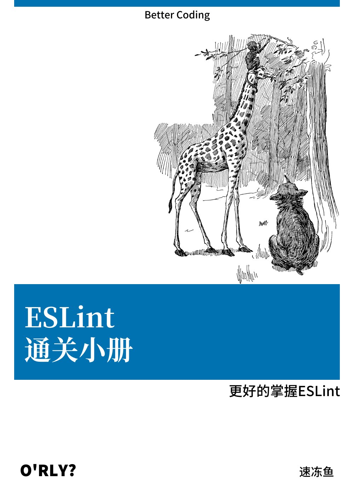
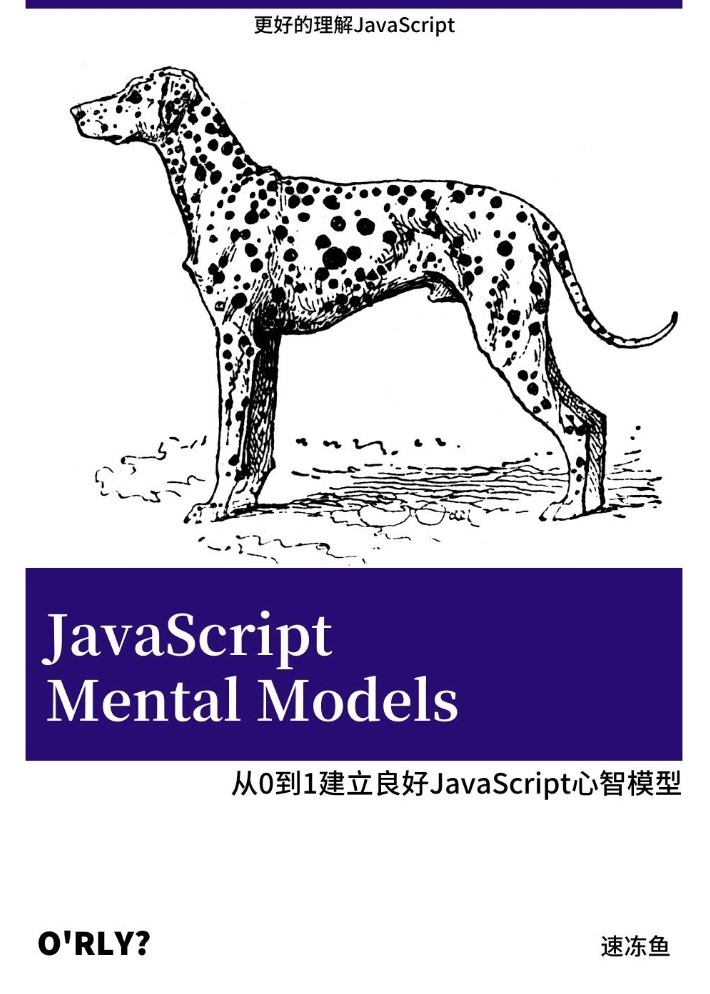
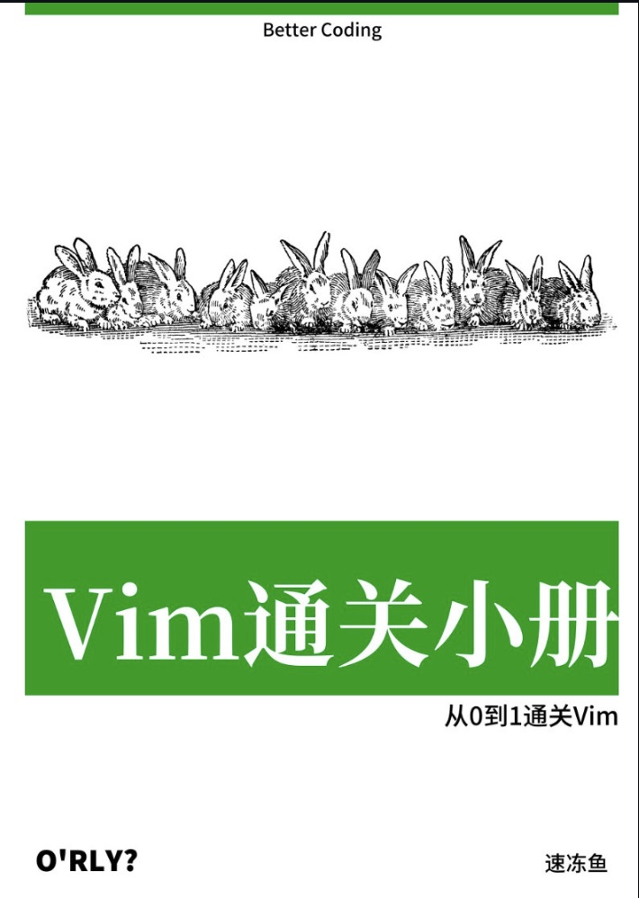

<h2>☀️ 你好 世界</h2>

哈喽，
我是速冻鱼儿🐟，坐标成都。我热爱开源，业余长期给各种开源项目贡献代码:

<ul>
  <li>
  unocss(team member)</li>
  <li>
  naive-ui</li>
  <li>
  vue</li>
  <li>
  vite</li>
  <li>
  vitest</li>
  <li>
  unplugin-vue-components</li>
  <li>
  rsocket-js</li>
  <li>
  vuejs-translations</li>
</ul>
<h2>📚 小册子</h2>

每当学习到一些有用的知识，我就会将它系统的整理为小册，方便自己，也分享他人，还有一些散文在我的掘金，如果需要转载，请注明 --转载自速冻鱼（链接🔗）

<table>
  <tbody align="left">
    <tr>
      <th align="center">
        
      </th>
      <th>
        <a href="https://github.com/sudongyuer/learn-eslint" target="_blank">《ESLint通关小册》</a>
      </th>
      <th>从0到1全面掌握ESLint</th>
      <th>
        
        
      </th>
    </tr>
    <tr>
      <th align="center">
        
      </th>
      <th>
        <a href="https://github.com/sudongyuer/javascript-mental-models" target="_blank">《javascript-mental-models》</a>
      </th>
      <th>帮助你建立良好的JavaScript心智模型</th>
      <th>
        
      </th>
    </tr>
    <tr>
      <th align="center">
        
      </th>
      <th>
        <a href="https://github.com/sudongyuer/learn-vim" target="_blank">《Vim通关小册》</a>
      </th>
      <th>从0到1通关Vim</th>
      <th>
        
      </th>
    </tr>
  </tbody>
</table>
<h2>🙌 文章</h2>
<table>
  <tr>
    <td>
      
    </td>
  </tr>
</table>
<h2>💼 repo</h2>

下面是我在学前端的路上写的一些个人项目，还有在公司写的一些开源项目，有的比较认真 🧐，有的只是为了好玩 🎮，有的比较沙雕 🤪。

<table>
  <thead align="center">
    <tr>
      <th>项目</th>
      <th>Github</th>
      <th>简述</th>
      <th>技术</th>
      <th>成就</th>
    </tr>
  </thead>
  <tbody align="left">
    <tr>
      <th>
        <a href="https://github.com/sudongyuer/easy-tinypng-cli" target="_blank">
        easy-tinypng-cli</a>
      </th>
      <th>
        <a href="https://github.com/sudongyuer/easy-tinypng-cli" target="_blank">Github</a>
      </th>
      <th>🐼 自动压缩图片的命令行工具</th>
      <th>
        
        
      </th>
      <th>
        
      </th>
    </tr>
    <tr>
      <th>
        <a href="https://github.com/sudongyuer/vite-plugin-react-inspector" target="_blank">
        vite-plugin-react-inspector</a>
      </th>
      <th>
        <a href="https://github.com/sudongyuer/vite-plugin-react-inspector" target="_blank">Github</a>
      </th>
      <th>🦋 从浏览器跳转到IDE源代码</th>
      <th>
        
        
        
      </th>
      <th>
        
      </th>
    </tr>
    <tr>
      <th>
        <a href="https://github.com/sudongyuer/vite-plugin-hot-export" target="_blank">
        vite-plugin-hot-export</a>
      </th>
      <th>
        <a href="https://github.com/sudongyuer/vite-plugin-hot-export" target="_blank">Github</a>
      </th>
      <th>🐝 可自动导出文件并且支持热更新</th>
      <th>
        
        
      </th>
      <th>
        
      </th>
    </tr>
    <tr>
      <th>
        <a href="https://github.com/sudongyuer/auto-export" target="_blank">
        auto-export</a>
      </th>
      <th>
        <a href="https://github.com/sudongyuer/auto-export" target="_blank">Github</a>
      </th>
      <th>✨ 一个cli可以自动导出同类型的文件</th>
      <th>
        
        
      </th>
      <th>
        
      </th>
    </tr>
    <tr>
      <th>
        <a href="https://github.com/sudongyuer/unxlsx" target="_blank">
        unxlsx</a>
      </th>
      <th>
        <a href="https://github.com/sudongyuer/unxlsx" target="_blank">Github</a>
      </th>
      <th>🌸 可以自动从多个 Excel 文件自动生成导出文件的CLI</th>
      <th>
        
        
      </th>
      <th>
        
      </th>
    </tr>
    <tr>
      <th>
        <a href="https://mini-slack.vercel.app/" target="_blank">
        mini-slack</a>
      </th>
      <th>
        <a href="https://github.com/sudongyuer/mini-slack" target="_blank">Github</a>
      </th>
      <th>🦄 slack的mini版(react、redux、ts、firebase、styled-components、vite、pnpm)</th>
      <th>
        
        
        
        
      </th>
      <th>
        
      </th>
    </tr>
    <tr>
      <th>
        <a href="https://github.com/HaiyaoTec/heimdall-ts" target="_blank">
        heimdall-ts</a>
      </th>
      <th>
        <a href="https://github.com/HaiyaoTec/heimdall-ts" target="_blank">Github</a>
      </th>
      <th>🏎 一个可以帮助轻松生成typescript API模块的CLI</th>
      <th>
        
        
      </th>
      <th>
        
        
      </th>
    </tr>
    <tr>
      <th>
        <a href="https://mini-spotify-rose.vercel.app/" target="_blank">
        mini-spotify</a>
      </th>
      <th>
        <a href="https://github.com/sudongyuer/mini-spotify" target="_blank">Github</a>
      </th>
      <th>🎸 spotify音乐播放器(next.js、nextauth 、recoil、ts、tailwind、spotify api、middleware、pnpm)</th>
      <th>
        
        
        
      </th>
      <th>
        
      </th>
    </tr>
    <tr>
      <th>
        <a href="https://github.com/sudongyuer/toy-browser" target="_blank">
        toy-browser</a>
      </th>
      <th>
        <a href="https://github.com/sudongyuer/toy-browser" target="_blank">Github</a>
      </th>
      <th>🌍 一个玩具浏览器模拟浏览器渲染^_^</th>
      <th>
        
        
      </th>
      <th>
        
      </th>
    </tr>
    <tr>
      <th>
        <a href="http://rsocketman.com/" target="_blank">
        rsocketMan</a>
      </th>
      <th>
        <a href="https://github.com/HaiyaoTec/rsocketMan" target="_blank">Github</a>
      </th>
      <th>🍁 一个调试rsocket协议的web开发工具</th>
      <th>
        
        
        
      </th>
      <th>
        
      </th>
    </tr>
    <tr>
      <th>
        <a href="https://github.com/sudongyuer/antd-table-2-xlsx" target="_blank">
        antd-table-2-xlsx</a>
      </th>
      <th>
        <a href="https://github.com/sudongyuer/antd-table-2-xlsx" target="_blank">Github</a>
      </th>
      <th>🐥 将antd table转换为xlsx的一种非常简单的方法</th>
      <th>
        
        
        
      </th>
      <th>
        
      </th>
    </tr>
    <tr>
      <th>
        <a href="https://github.com/HaiyaoTec/craft-client" target="_blank">
        craft-client</a>
      </th>
      <th>
        <a href="https://github.com/HaiyaoTec/craft-client" target="_blank">Github</a>
      </th>
      <th>👑 非常简单得生成docker镜像</th>
      <th>
        
        
      </th>
      <th>
        
      </th>
    </tr>
    <tr>
      <th>
        <a href="https://github.com/HaiyaoTec/window-channel" target="_blank">
        window-channel</a>
      </th>
      <th>
        <a href="https://github.com/HaiyaoTec/window-channel" target="_blank">Github</a>
      </th>
      <th>🌈 一个非常简单的window通信库</th>
      <th>
        
        
      </th>
      <th>
        
      </th>
    </tr>
    <tr>
      <th>
        <a href="https://github.com/HaiyaoTec/info-js" target="_blank">
        info-js</a>
      </th>
      <th>
        <a href="https://github.com/HaiyaoTec/info-js" target="_blank">Github</a>
      </th>
      <th>🥷 一个可以帮助您简单获取客户端信息的库</th>
      <th>
        
        
      </th>
      <th>
        
      </th>
    </tr>
    <tr>
      <th>
        <a href="https://github.com/sudongyuer/eslint-config" target="_blank">
        eslint-config</a>
      </th>
      <th>
        <a href="https://github.com/sudongyuer/eslint-config" target="_blank">Github</a>
      </th>
      <th>🐇 开箱即用的ESLint Config</th>
      <th>
        
        
        
      </th>
      <th>
        
      </th>
    </tr>
    <tr>
      <th>
        <a href="https://movie-gallery-sudongyuer.vercel.app/" target="_blank">
        movie-gallery</a>
      </th>
      <th>
        <a href="https://github.com/sudongyuer/movie-gallery" target="_blank">Github</a>
      </th>
      <th>🍁 在线电影简评网站(TypeScript Next.js Tailwind Pnpm CssGrid Responsive react-flip-move react-modal Sass)</th>
      <th>
        
        
        
      </th>
      <th>
        
      </th>
    </tr>
    <tr>
      <th>
        <a href="https://github.com/sudongyuer/turbo-cache-transport" target="_blank">
        turbo-cache-transport</a>
      </th>
      <th>
        <a href="https://github.com/sudongyuer/turbo-cache-transport" target="_blank">Github</a>
      </th>
      <th>👻 turbo 缓存搬运工</th>
      <th>
        
        
      </th>
      <th>
        
      </th>
    </tr>
    <tr>
      <th>
        <a href="https://github.com/sudongyuer/mini-vue3" target="_blank">
        mini-vue3</a>
      </th>
      <th>
        <a href="https://github.com/sudongyuer/mini-vue3" target="_blank">Github</a>
      </th>
      <th>🙃 mini vue3 实现</th>
      <th>
        
      </th>
      <th>
        
      </th>
    </tr>
    <tr>
      <th>
        <a href="https://github.com/sudongyuer/mini-vue-router" target="_blank">
        mini-vue-router</a>
      </th>
      <th>
        <a href="https://github.com/sudongyuer/mini-vue-router" target="_blank">Github</a>
      </th>
      <th>🐧 一个mini vue-router，你可以学习vue-router的原理</th>
      <th>
        
        
      </th>
      <th>
        
      </th>
    </tr>
  </tbody>
</table>
